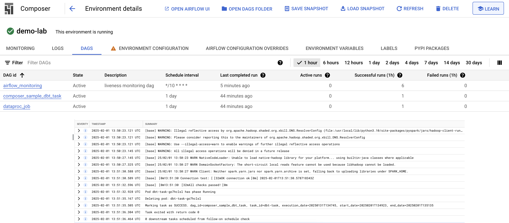
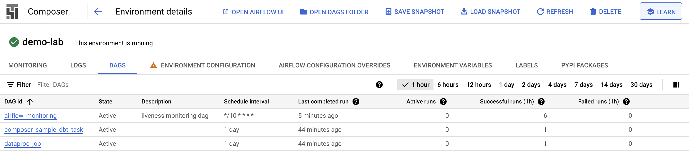
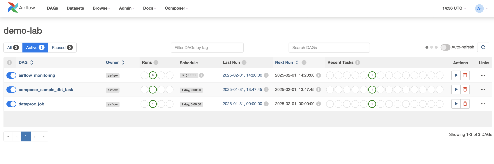
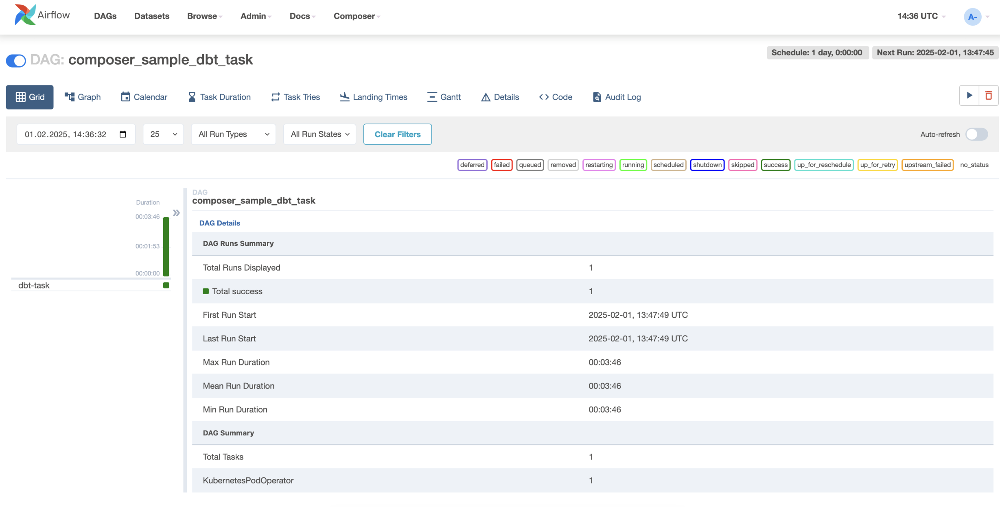
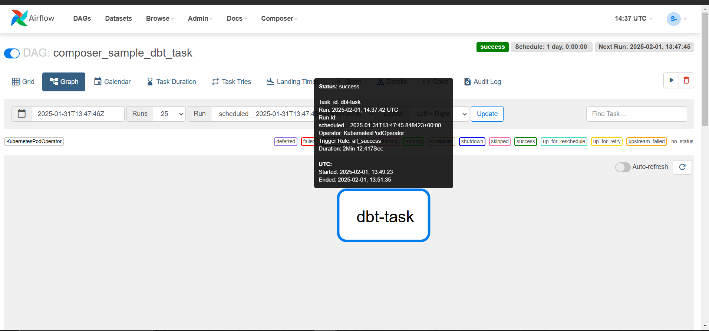

IMPORTANT ❗ ❗ ❗ Please remember to destroy all the resources after each work session. You can recreate infrastructure by creating new PR and merging it to master.


0. The goal of this phase is to create infrastructure, perform benchmarking/scalability tests of sample three-tier lakehouse solution and analyze the results using:

- [TPC-DI benchmark](https://www.tpc.org/tpcdi/)
- [dbt - data transformation tool](https://www.getdbt.com/)
- [GCP Composer - managed Apache Airflow](https://cloud.google.com/composer?hl=pl)
- [GCP Dataproc - managed Apache Spark](https://spark.apache.org/)
- [GCP Vertex AI Workbench - managed JupyterLab](https://cloud.google.com/vertex-ai-notebooks?hl=pl)

Worth to read:

- https://docs.getdbt.com/docs/introduction
- https://airflow.apache.org/docs/apache-airflow/stable/index.html
- https://spark.apache.org/docs/latest/api/python/index.html
- https://medium.com/snowflake/loading-the-tpc-di-benchmark-dataset-into-snowflake-96011e2c26cf
- https://www.databricks.com/blog/2023/04/14/how-we-performed-etl-one-billion-records-under-1-delta-live-tables.html

2.  Authors:

    **_Enter your group nr_**

    **_Link to forked repo_**

3.  Sync your repo with https://github.com/bdg-tbd/tbd-workshop-1.

4.  Provision your infrastructure.

        a) setup Vertex AI Workbench `pyspark` kernel as described in point [8](https://github.com/bdg-tbd/tbd-workshop-1/tree/v1.0.32#project-setup)

        b) upload [tpc-di-setup.ipynb](https://github.com/bdg-tbd/tbd-workshop-1/blob/v1.0.36/notebooks/tpc-di-setup.ipynb) to

    the running instance of your Vertex AI Workbench

5.  In `tpc-di-setup.ipynb` modify cell under section **_Clone tbd-tpc-di repo_**:

    a)first, fork https://github.com/mwiewior/tbd-tpc-di.git to your github organization.

    b)create new branch (e.g. 'notebook') in your fork of tbd-tpc-di and modify profiles.yaml by commenting following lines:

    ```
         #"spark.driver.port": "30000"
         #"spark.blockManager.port": "30001"
         #"spark.driver.host": "10.11.0.5"  #FIXME: Result of the command (kubectl get nodes -o json |  jq -r '.items[0].status.addresses[0].address')
         #"spark.driver.bindAddress": "0.0.0.0"
    ```

    This lines are required to run dbt on airflow but have to be commented while running dbt in notebook.

    c)update git clone command to point to **_your fork_**.

6.  Access Vertex AI Workbench and run cell by cell notebook `tpc-di-setup.ipynb`.

        a) in the first cell of the notebook replace: `%env DATA_BUCKET=tbd-2023z-9910-data` with your data bucket.

        b) in the cell:
        `%%bash

    mkdir -p git && cd git
    git clone https://github.com/mwiewior/tbd-tpc-di.git
    cd tbd-tpc-di
    git pull
    `
    replace repo with your fork. Next checkout to 'notebook' branch.

        c) after running first cells your fork of `tbd-tpc-di` repository will be cloned into Vertex AI enviroment (see git folder).

        d) take a look on `git/tbd-tpc-di/profiles.yaml`. This file includes Spark parameters that can be changed if you need to increase the number of executors and

```
 server_side_parameters:
     "spark.driver.memory": "2g"
     "spark.executor.memory": "4g"
     "spark.executor.instances": "2"
     "spark.hadoop.hive.metastore.warehouse.dir": "hdfs:///user/hive/warehouse/"
```

7. Explore files created by generator and describe them, including format, content, total size.

Wygenerowany zestaw danych to TPC-DI (Transaction Processing Performance Council - Data Integration). TPC-DI jest standardem do testowania wydajności baz danych przy użyciu generowanych danych.

Plik _Batch1_audit.csv_ zawiera dwa wiersze informujące o przedziale czasowym, z którego pochodzą dane - dane z przeprowadzanego audytu finansowego. Pierwszy wiersz przedstawia datę początkową (rok 1950), a drugi – datę końcową (rok 2017). Dane te obejmują zatem rozległy okres historyczny. Analogiczne informacje znajdują się w plikach _Batch2_audit.csv_ oraz _Batch3_audit.csv_, lecz dotyczą one bardziej aktualnych i krótszych przedziałów czasowych:
_Batch2_audit.csv_ zawiera dane z dnia 2017-07-08 (odpowiadające dniowi poprzedniemu),
_Batch3_audit.csv_ odnosi się do dnia 2017-07-09 (reprezentując dzień bieżący).

W folderach _Batch1, Batch2_ oraz _Batch3_ znajdują się dane dotyczą różnych aspektów działalności audytowanych przedsiębiorstw, obejmujące takie obszary jak transakcje gotówkowe (Cash transaction), zarządzanie klientami (Customer management) czy codzienny rynek (Daily market).

Do każdej dziedziny danych wygenerowane zostały dwa pliki - jeden w formacie csv, drugi w txt (przykładowo _TradeHistory_audit.csv_ oraz _TradeHistory.txt_). Plik CSV zawiera podsumowanie i agregację danych, przedstawiając różne atrybuty związane z daną dziedziną. Znajdują się tam takie informacje jak liczba rekordów, operacji czy zdarzeń w określonym okresie czasu. Może zawierać również dane o stanie różnych elementów, takich jak liczba utworzonych kont, zamkniętych transakcji, zaktualizowanych informacji, itp.
Plik TXT zawiera już szczegółowe dane o każdym rejestrowanym zdarzeniu, często w formie zapisów transakcji lub innych jednostkowych zdarzeń. Zawiera informacje takie jak daty, wartości operacji, identyfikatory, a także inne szczegóły związane z każdym zdarzeniem. W przeciwieństwie do pliku CSV, plik tekstowy może być używany do bardziej zaawansowanej analizy, np. w przypadku potrzeby prześledzenia poszczególnych operacji w danej dziedzinie.

Podsumowanie liczby rekordów:


Łączny rozmiar danych: 

8. Analyze tpcdi.py. What happened in the loading stage?

W kodzie tpcdi.py, który uruchamiany był w loading stage, zdefiniowana jest funkcja _upload_files_, która przesyła pliki do Google Cloud Storage lub innej lokalizacji wskazanej przez stage*path. Funkcja ta przeszukuje katalog output_directory w poszukiwaniu plików pasujących do wzorca, a następnie w zależności od typu pliku ustawia odpowiedni delimiter (np. przecinek dla CSV). Następnie pliki są przesyłane do chmury, a ich nazwa jest używana jako nazwa bloba w GCS. Jest ona wywoływana przez funkcję \_load_csv*.

Kolejnym krokiem jest funkcja _load_csv_, która odpowiedzialna jest za załadowanie plików CSV z GCS do DataFrame w Spark. Na początku ustalana jest ścieżka do wgranego pliku, a potem wywoływana jest funkcja _upload_files_, która załadowuje pliki do GCS. Następnie dane z GCS są wczytywane przy użyciu Spark, z uwzględnieniem podanego schematu, który opisuje strukturę danych w pliku. Po załadowaniu danych, wynikowy DataFrame jest przekazywany do funkcji _save_df_.

Funkcja _save_df_ sprawdza, czy zmienna show jest ustawiona na True. Jeśli tak, dane w DataFrame są po prostu wyświetlane na ekranie za pomocą df.show(). Jeśli show jest ustawione na False, dane są zapisywane do systemu w formacie parquet, a dodatkowo tworzona jest tabela o nazwie określonej przez table_name. Tabela jest zapisywana w trybie nadpisywania, co oznacza, że jeżeli tabela o tej samej nazwie już istnieje, zostanie zastąpiona.

Pliki zostały wgrane do naszego bucketa w GCS:


9. Using SparkSQL answer: how many table were created in each layer?

   **_SparkSQL command and output_**

_TU JAKIŚ SCREEN Z GOOGLE CLOUD STORAGE, ŻE TE DANE ZOSTAŁY WRZUCONE, POWSTAŁY JAKIEŚ TABELE CZY COŚ_

11. Add some 3 more [dbt tests](https://docs.getdbt.com/docs/build/tests) and explain what you are testing. **_Add new tests to your repository._**

      Link do folderu z testami: [test](https://github.com/spacerunner00/tbd-tpc-di/tree/branch-02-test/tests)

  [Test 1.](https://github.com/spacerunner00/tbd-tpc-di/blob/branch-02-test/tests/assert_fact_trade_executed_by_not_empty.sql) Sprawdza, czy wartości w kolumnie ``execuded_by`` nie są NULL ani puste.
   ```SQL
      SELECT
          sk_trade_id,
          executed_by
      FROM {{ ref('fact_trade') }}
      WHERE executed_by IS NULL OR executed_by = ''
   ```
[Test 2.](https://github.com/spacerunner00/tbd-tpc-di/blob/branch-02-test/tests/assert_fact_trade_sk_trade_id_not_null.sql) Sprawdza, czy wartości w kolumnie ``sk_trade_id`` nie są NULL.
  ```SQL
    SELECT
        sk_trade_id
    FROM {{ ref('fact_trade') }}
    WHERE sk_trade_id IS NULL
  ```

[Test 3.](https://github.com/spacerunner00/tbd-tpc-di/blob/branch-02-test/tests/assert_total_payment_amount_is_positive.sql) Sprawdza, czy suma wartości w kolumnie ``amount`` dla każdego ``order_id`` nie jest ujemna.
  ```SQL
      select
          order_id,
          sum(amount) as total_amount
      from {{ ref('fct_payments') }}
      group by 1
      having total_amount < 0
  ```

[Test 4.](https://github.com/spacerunner00/tbd-tpc-di/blob/branch-02-test/tests/assert_trade_price_is_non_negative.sql) Sprawdza, czy wartości w kolumnie ``trade_price`` dla każdego ``sk_trade_id`` nie są ujemne.
 ```SQL
       SELECT
        sk_trade_id,
        trade_price
    FROM {{ ref('fact_trade') }}
    WHERE trade_price < 0
  ```


12. In main.tf update

```
dbt_git_repo            = "https://github.com/mwiewior/tbd-tpc-di.git"
dbt_git_repo_branch     = "main"
```

so dbt_git_repo points to your fork of tbd-tpc-di.

12. Redeploy infrastructure and check if the DAG finished with no errors:






