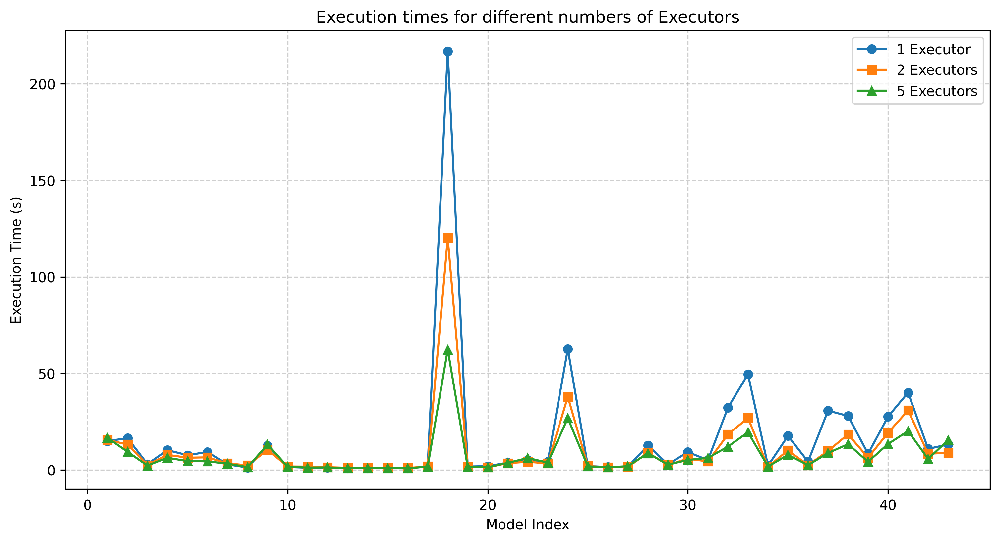

0. The goal of phase 2b is to perform benchmarking/scalability tests of sample three-tier lakehouse solution.

1. In main.tf, change machine_type at:

```
module "dataproc" {
  depends_on   = [module.vpc]
  source       = "github.com/bdg-tbd/tbd-workshop-1.git?ref=v1.0.36/modules/dataproc"
  project_name = var.project_name
  region       = var.region
  subnet       = module.vpc.subnets[local.notebook_subnet_id].id
  machine_type = "e2-standard-2"
}
```

and subsititute "e2-standard-2" with "e2-standard-4".

2. If needed request to increase cpu quotas (e.g. to 30 CPUs):
   https://console.cloud.google.com/apis/api/compute.googleapis.com/quotas?project=tbd-2023z-9918

Prewencyjnie zgłosiliśmy prośbę o 48 CPU:


4. Using tbd-tpc-di notebook perform dbt run with different number of executors, i.e., 1, 2, and 5, by changing:

```
 "spark.executor.instances": "2"
```

in profiles.yml.

Nasze dane były stworzone z scale factor = 10 (krok "Generate input dataset" w Jupyter notebooku)

5. In the notebook, collect console output from dbt run, then parse it and retrieve total execution time and execution times of processing each model. Save the results from each number of executors.

| Index | Model                                  | executors_1 | executors_2 | executors_5 |
| ----- | -------------------------------------- | ----------- | ----------- | ----------- |
| 1     | demo_bronze.brokerage_cash_transaction | 14.95       | 15.55       | 16.59       |
| 2     | demo_bronze.brokerage_daily_market     | 16.42       | 13.13       | 9.38        |
| 3     | demo_bronze.brokerage_holding_history  | 2.97        | 2.47        | 2.24        |
| 4     | demo_bronze.brokerage_trade            | 10.23       | 7.8         | 6.28        |
| 5     | demo_bronze.brokerage_trade_history    | 7.62        | 6.33        | 4.56        |
| 6     | demo_bronze.brokerage_watch_history    | 9.34        | 6.51        | 4.45        |
| 7     | demo_bronze.crm_customer_mgmt          | 2.85        | 3.4         | 3.23        |
| 8     | demo_bronze.finwire_company            | 1.27        | 2.36        | 1.45        |
| 9     | demo_bronze.finwire_financial          | 12.54       | 10.41       | 13.18       |
| 10    | demo_bronze.finwire_security           | 1.55        | 1.8         | 1.65        |
| 11    | demo_bronze.hr_employee                | 1.14        | 1.7         | 1.22        |
| 12    | demo_bronze.reference_date             | 1.26        | 1.45        | 1.31        |
| 13    | demo_bronze.reference_industry         | 0.92        | 1.08        | 0.93        |
| 14    | demo_bronze.reference_status_type      | 0.91        | 1.01        | 0.93        |
| 15    | demo_bronze.reference_tax_rate         | 0.99        | 0.96        | 0.94        |
| 16    | demo_bronze.reference_trade_type       | 0.85        | 1.0         | 0.84        |
| 17    | demo_bronze.syndicated_prospect        | 1.82        | 1.83        | 1.74        |
| 18    | demo_silver.daily_market               | 216.8       | 120.1       | 62.31       |
| 19    | demo_silver.employees                  | 1.76        | 1.51        | 1.51        |
| 20    | demo_silver.date                       | 1.98        | 1.41        | 1.38        |
| 21    | demo_silver.companies                  | 3.75        | 3.52        | 3.65        |
| 22    | demo_silver.accounts                   | 5.22        | 4.21        | 6.17        |
| 23    | demo_silver.customers                  | 4.35        | 3.37        | 3.77        |
| 24    | demo_silver.trades_history             | 62.65       | 37.88       | 26.79       |
| 25    | demo_gold.dim_broker                   | 2.02        | 1.99        | 1.86        |
| 26    | demo_gold.dim_date                     | 1.48        | 1.4         | 1.36        |
| 27    | demo_gold.dim_company                  | 1.65        | 1.5         | 1.94        |
| 28    | demo_silver.financials                 | 12.62       | 8.91        | 8.64        |
| 29    | demo_silver.securities                 | 2.92        | 2.56        | 2.76        |
| 30    | demo_silver.cash_transactions          | 9.24        | 5.82        | 5.15        |
| 31    | demo_gold.dim_customer                 | 5.07        | 4.4         | 6.23        |
| 32    | demo_gold.dim_trade                    | 32.24       | 18.35       | 12.07       |
| 33    | demo_silver.trades                     | 49.54       | 26.88       | 19.51       |
| 34    | demo_gold.dim_security                 | 2.17        | 1.61        | 1.8         |
| 35    | demo_silver.watches_history            | 17.62       | 10.11       | 7.8         |
| 36    | demo_gold.dim_account                  | 4.3         | 2.46        | 2.48        |
| 37    | demo_silver.holdings_history           | 30.67       | 9.81        | 8.77        |
| 38    | demo_silver.watches                    | 27.93       | 18.41       | 13.32       |
| 39    | demo_gold.fact_cash_transactions       | 8.38        | 6.36        | 4.24        |
| 40    | demo_gold.fact_trade                   | 27.62       | 19.21       | 13.43       |
| 41    | demo_gold.fact_holdings                | 40.02       | 30.79       | 20.14       |
| 42    | demo_gold.fact_watches                 | 10.9        | 8.36        | 5.71        |
| 43    | demo_gold.fact_cash_balances           | 13.18       | 8.89        | 15.44       |


| Liczba executorów | Czas całkowity |
| ----------------- | -------------- |
| 1                 |  683.71        |
| 2                 |  438.61        |
| 5                 |  329.15        |

6. Analyze the performance and scalability of execution times of each model. Visualize and discucss the final results.


