IMPORTANT ❗ ❗ ❗ Please remember to destroy all the resources after each work session. You can recreate infrastructure by creating new PR and merging it to master.


# 1. Authors:

- Aleksandra Gryzik
- Gabriel Skowron-Rodriguez
- Jakub Rozkosz

Group nr: 13</p>
Link to forked repo: https://github.com/spacerunner00/tbd-workshop-1.git

# 3. Follow all steps in README.md.

# 4. Select your project and set budget alerts on 5%, 25%, 50%, 80% of 50$ (in cloud console -> billing -> budget & alerts -> create buget; unclick discounts and promotions&others while creating budget).


# 5. From avaialble Github Actions select and run destroy on main branch.


# 6. Create new git branch and:

1.  Modify tasks-phase1.md file.

2.  Create PR from this branch to **YOUR** master and merge it to make new release.


# 7. Analyze terraform code. Play with terraform plan, terraform graph to investigate different modules.


### module.dataproc

- **Lokalizacja:** `./modules/dataproc/`
- **Moduł `module.dataproc`** to moduł Terraform odpowiedzialny za stworzenie klastra Dataproc w Google Cloud.

Do jego zasobów należą:

- **google_project_service.dataproc**  
  Odpowiada za włączenie usługi API Dataproc w projekcie. Jest to kluczowy krok przed utworzeniem klastra, ponieważ bez aktywnego API Dataproc utworzenie klastra Dataproc nie byłoby możliwe.
- **google_dataproc_cluster.tbd-dataproc-cluster**  
  Odpowiada za konfigurację i utworzenie klastra Dataproc. W tym zasobie definiowane są szczegóły konfiguracji klastra, takie jak:
  - liczba i rodzaj węzłów (_master_ i _worker nodes_)
  - rodzaj maszyn wirtualnych i ich zasoby (typ maszyn, dyski, sieć)
  - oprogramowanie i inicjalizacja, w tym wersja obrazu oraz skrypty inicjalizacyjne

# 8. Reach YARN UI


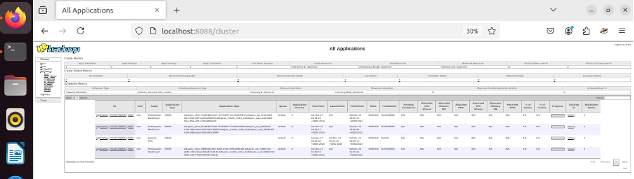

**Polecenie użyte do ustawienia tunelu:**

```bash
gcloud compute ssh tbd-cluster-m \
  --project=tbd-2024zz-305978 \
  --zone=europe-west1-d \
  --tunnel-through-iap \
  -- -L 8088:localhost:8088
```

# 9. Draw an architecture diagram (e.g. in draw.io) that includes:

1.  VPC topology with service assignment to subnets
2.  Description of the components of service accounts
3.  List of buckets for disposal
4.  Description of network communication (ports, why it is necessary to specify the host for the driver) of Apache Spark running from Vertex AI Workbech

### Diagram


### VPC Network

- **Nazwa VPC:** main-vpc
- **Liczba podsieci:** 2
  - **Podsieć 1:** composer-subnet-01
    - Gateway: 10.11.0.1
    - Region: europe-west1
    - Primary IPv4 range: 10.11.0.0/16
  - **Podsieć 2:** subnet-01
    - Gateway: 10.11.0.1
    - Region: europe-west1
    - Primary IPv4 range: 10.10.10.0/24

### Service Accounts

- **tbd-2024zz-305978-data@tbd-2024zz-305978.iam.gserviceaccount.com**
  - Opis: Konto usługowe przypisane do przetwarzania danych w środowiskach takich jak Cloud Composer, Dataproc, czy BigQuery.
  - Rola: Zarządza orkiestracją zadań związanych z danymi oraz koordynuje operacje między komponentami w projekcie.
- **tbd-2024zz-305978-lab@tbd-2024zz-305978.iam.gserviceaccount.com**
  - Opis: Konto przypisane do Terraform, odpowiedzialne za zarządzanie infrastrukturą Google Cloud.
  - Rola: Pozwala na automatyczne wdrażanie, modyfikację i usuwanie zasobów w projekcie za pomocą Terraform.
- **587948061270-compute@developer.gserviceaccount.com**
  - Opis: Domyślne konto Compute Engine wykorzystywane przez wirtualne maszyny w Google Cloud.
  - Rola: Umożliwia maszynom wirtualnym dostęp do innych usług w Google Cloud (np. Cloud Storage, BigQuery) poprzez generowanie tokenów uwierzytelniających.

### Google Cloud Storage Buckets

- **dataproc-temp-europe-west1-587948061270**
  - Lokalizacja: europe-west1
  - Cel: Tymczasowe przechowywanie danych podczas operacji Dataproc
  - Zawartość:
    - Foldery:
      - mapreduce-job-history/ – Dane historii zadań MapReduce
      - spark-job-history/ – Dane historii zadań Spark
      - yarn-logs/ – Logi YARN
- **dataproc-staging-europe-west1-587948061270**
  - Lokalizacja: europe-west1
  - Cel: Staging danych dla Dataproc
  - Zawartość:
    - Foldery:
      - mapreduce-job-history/ – Historia zadań MapReduce
      - google-cloud-dataproc-metainfo/ – Metadane Dataproc
      - tbd-cluster-\* – Dane staging dla klastra
- **tbd-2024zz-305978-code**
  - Lokalizacja: europe-west1
  - Cel: Przechowywanie kodu dla zadań Spark
  - Zawartość:
    - Plik: spark-job.py – Skrypt do uruchamiania zadań Spark
- **tbd-2024zz-305978-conf**
  - Lokalizacja: europe-west1
  - Cel: Przechowywanie plików konfiguracyjnych
  - Zawartość:
    - Folder: scripts/
      - Plik: notebook_post_startup_script.sh – Skrypt uruchamiany po starcie notebooka
- **tbd-2024zz-305978-data**
  - Lokalizacja: europe-west1
  - Cel: Przechowywanie danych wejściowych i wyjściowych
  - Zawartość: Brak plików w tej chwili
- **tbd-2024zz-305978-state**
  - Lokalizacja: europe-west1
  - Cel: Przechowywanie stanu infrastruktury (np. Terraform state)
  - Zawartość:
    - Folder: cicd/
      - Plik: default.tfstate – Plik stanu Terraform

### Lista instancji VM

- **tbd-cluster-m**
  - Rola: Master node w klastrze Dataproc
  - Lokalizacja: europe-west1-d
  - Internal IP: 10.10.10.3
  - Typ maszyny: e2-standard-2
  - Konfiguracja:
    - CPU: Intel Broadwell
    - Pamięć: Standard dla e2-standard-2
  - Opis: Zarządza zadaniami w klastrze Dataproc. Koordynuje działania workerów.
- **tbd-cluster-w-0**
  - Rola: Worker node 0 w klastrze Dataproc
  - Lokalizacja: europe-west1-d
  - Internal IP: 10.10.10.2
  - Typ maszyny: e2-standard-2
  - Konfiguracja:
    - CPU: Intel Broadwell
  - Opis: Wykonuje zadania zlecone przez Master Node w ramach klastrów Dataproc.
- **tbd-cluster-w-1**
  - Rola: Worker node 1 w klastrze Dataproc
  - Lokalizacja: europe-west1-d
  - Internal IP: 10.10.10.4
  - Typ maszyny: e2-standard-2
  - Konfiguracja:
    - CPU: Intel Broadwell
  - Opis: Wykonuje zadania zlecone przez Master Node w ramach klastrów Dataproc.
- **tbd-2024zz-305978-notebook**
  - Rola: Vertex AI Workbench Notebook Instance
  - Lokalizacja: europe-west1-b
  - Internal IP: 10.10.10.5
  - Typ maszyny: e2-standard-2
  - Konfiguracja:
    - CPU: Intel Broadwell
  - Użycie: Środowisko do uruchamiania kodu Spark

### Apache Spark

Do poprawnego działania Apache Spark w środowisku Vertex AI Workbench wykorzystuje porty:

- **30000**
  - Port używany przez Spark Driver do komunikacji z Executorami
- **30001**
  - Port używany przez Spark Block Manager do przesyłania danych pomiędzy Executorami i Driverem
- **8088**
  - Port YARN ResourceManager Web UI, pozwala na monitorowanie stanu klastrów i zadań
- **8030-8033**
  - Porty YARN ResourceManager, zarządzające zasobami w klastrze
- **18080**
  - Port Spark History Server, służący do przeglądania logów i wyników zakończonych aplikacji Spark
- **10200**
  - Port Application History Server YARN, przechowuje historię zakończonych aplikacji

# 10. Create a new PR and add costs by entering the expected consumption into Infracost

For all the resources of type: `google_artifact_registry`, `google_storage_bucket`, `google_service_networking_connection`
create a sample usage profiles and add it to the Infracost task in CI/CD pipeline. Usage file [example](https://github.com/infracost/infracost/blob/master/infracost-usage-example.yml)

```yaml
usage:
google_artifact_registry.registry:
  storage_gb: 100

google_storage_bucket.tbd_code_bucket:
  storage_gb: 50
  monthly_class_a_operations: 5000
  monthly_class_b_operations: 2000
  monthly_egress_data_gb: 20

google_storage_bucket.tbd_data_bucket:
  storage_gb: 500
  monthly_class_a_operations: 10000
  monthly_class_b_operations: 5000
  monthly_egress_data_gb: 200

google_service_networking_connection.private_vpc_connection:
  monthly_data_processed_gb: 1000
```

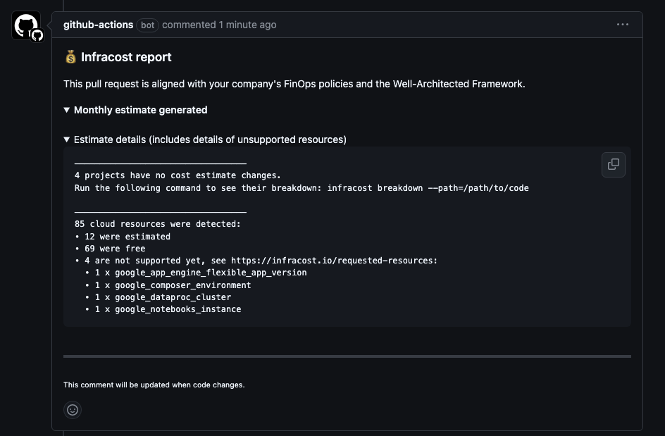

# 11. Create a BigQuery dataset and an external table using SQL

```sql
CREATE SCHEMA IF NOT EXISTS demo OPTIONS(location = 'europe-west1');

CREATE OR REPLACE EXTERNAL TABLE demo.shakespeare
OPTIONS (
  format = 'ORC',
  uris = ['gs://tbd-2024zz-305978-data/data/shakespeare/*.orc']
);

SELECT * FROM demo.shakespeare ORDER BY sum_word_count DESC LIMIT 5;
```

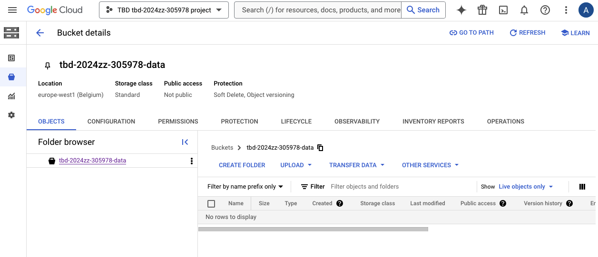
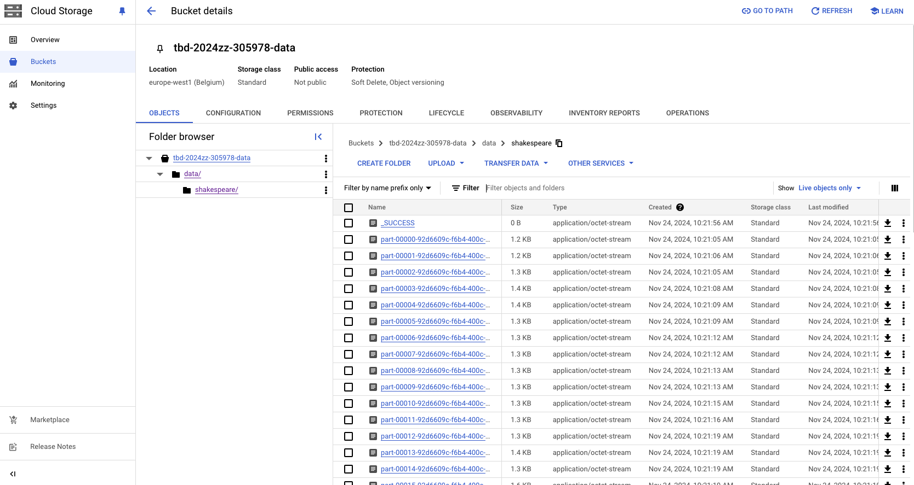
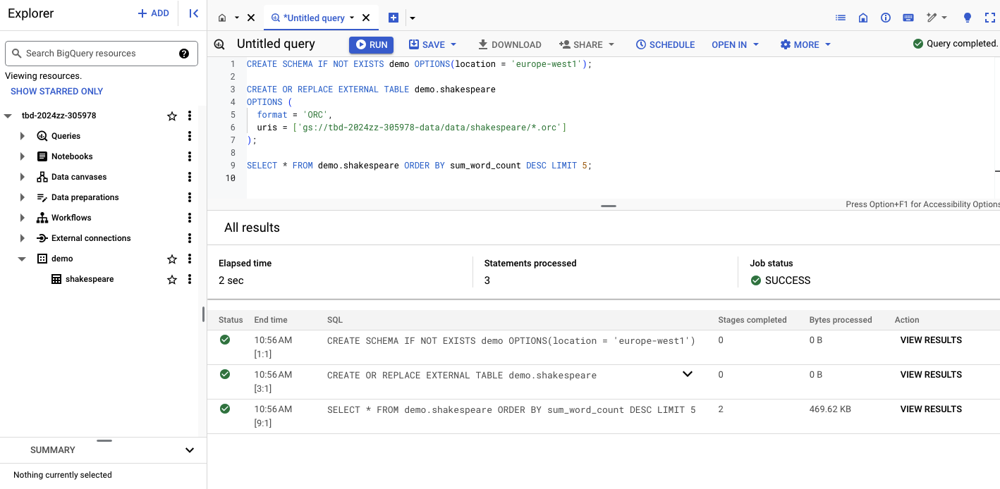
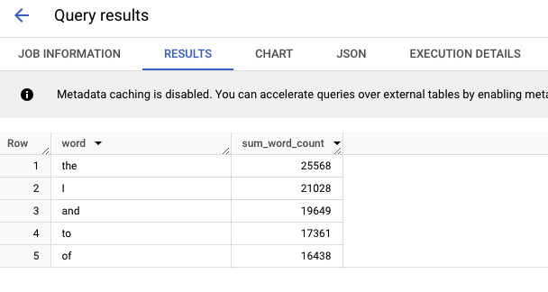

**_why does ORC not require a table schema?_**
ORC nie wymaga schematu tabeli w SQL, ponieważ schemat danych jest wbudowany w plik typu ORC jako część jego metadanych. BigQuery wykorzystuje te informacje do automatycznego rozpoznawania struktury danych, co eliminuje potrzebę ręcznej konfiguracji schematu podczas tworzenia i integracji z tabelą zewnętrzną.

# 12. Start an interactive session from Vertex AI workbench:


# 13. Find and correct the error in spark-job.py

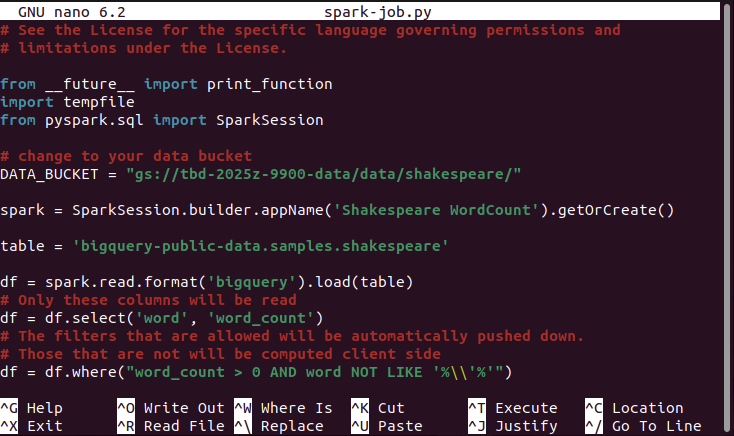
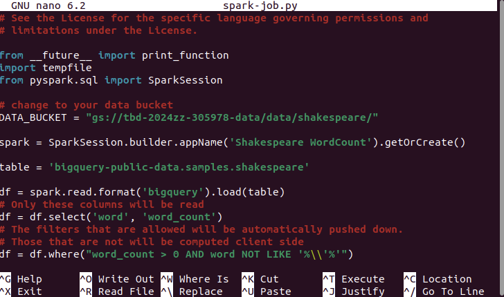

W pliku `spark-job.py` była błędna nazwa bucketa, która została zmienona z:

`DATA_BUCKET = "gs://tbd-2025z-9900-data/data/shakespeare/"`

na:

`DATA_BUCKET = "gs://tbd-2024zz-305978-data/data/shakespeare/"`

(jest to również widoczne na powyższych obrazkach)

# 14. Additional tasks using Terraform:

1.  Add support for arbitrary machine types and worker nodes for a Dataproc cluster and JupyterLab instance

Dodaliśmy wsparcie dla dowolnej liczby worker node'ów dla klastra Dataproc w następujący sposób (dowolny typ maszyny już był wspierany):

[modules/dataproc/variables.tf](modules/dataproc/variables.tf)

    ```
    variable "worker_count" {
      type        = number
      default     = 2
      description = "Number of worker nodes for Dataproc cluster"
    }
    ```

[modules/dataproc/main.tf](modules/dataproc/main.tf)

    ```
    worker_config {
          num_instances = var.worker_count
          machine_type  = var.machine_type
          disk_config {
            boot_disk_type    = "pd-standard"
            boot_disk_size_gb = 100
          }

        }
    ```

    Oraz wsparcie dla dowolnej maszyny dla JupyterLab notebooka:

[modules/vertex-ai-workbench/variables.tf](modules/vertex-ai-workbench/variables.tf)

    ```
    variable "machine_type" {
      type        = string
      default     = "e2-standard-2"
      description = "Machine type to use for the JupyterLab instance"
    }
    ```

[modules/vertex-ai-workbench/main.tf](modules/vertex-ai-workbench/main.tf)

    ```
    resource "google_notebooks_instance" "tbd_notebook" {
      ...
      machine_type = var.machine_type
      ...
    }
    ```

2. Add support for preemptible/spot instances in a Dataproc cluster

Dodaliśmy wsparcie dla instancji preemptible w klastrze Dataproc:

[modules/dataproc/variables.tf](modules/dataproc/variables.tf)

```
variable "preeemptible_worker_count" {
  type        = number
  default     = 1
  description = "Number of preemptible worker nodes for Dataproc cluster"
 }
```

[modules/dataproc/main.tf](modules/dataproc/main.tf)

    ```
      preemptible_worker_config {
          num_instances = var.preeemptible_worker_count
          disk_config {
            boot_disk_type    = "pd-standard"
            boot_disk_size_gb = 100
          }

          preemptibility = "SPOT"
        }
    ```

Widać że "preemptibility" jest już włączone:
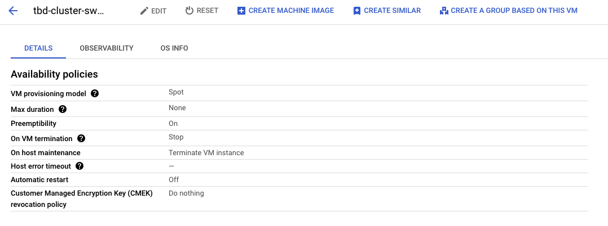

3.  Perform additional hardening of Jupyterlab environment, i.e. disable sudo access and enable secure boot

Wyłaczyliśmy dostęp do sudo i włączyliśmy secure boot dla środowiska Jupyterlab

[modules/vertex-ai-workbench/main.tf](modules/vertex-ai-workbench/main.tf)

```
resource "google_notebooks_instance" "tbd_notebook" {
 ...
  metadata = {
    ...
    notebook-disable-root = "true"
  }
  ...
  shielded_instance_config {
    enable_secure_boot = true
  }
 ...
 }
```

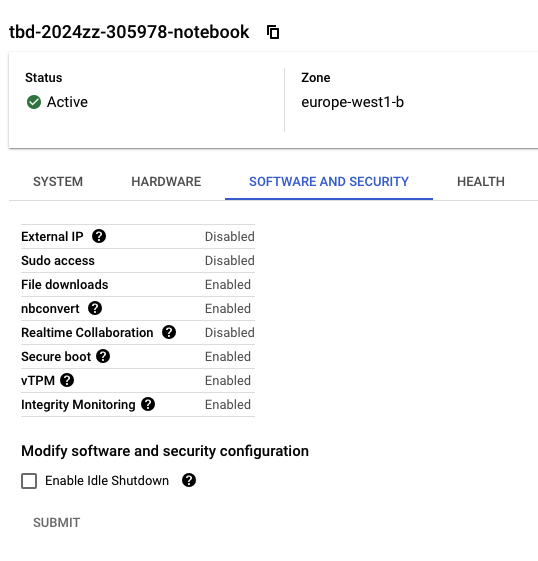

4.  (Optional) Get access to Apache Spark WebUI

[modules/dataproc/main.tf](modules/dataproc/main.tf)

```
cluster_config {
  endpoint_config {
      enable_http_port_access = "true"
    }
  ...
 }
```

Spark WebUI jest dostępny w Google Cloud: Dataproc > Clusters > tbd-cluster > Web Interfaces > Spark History Server
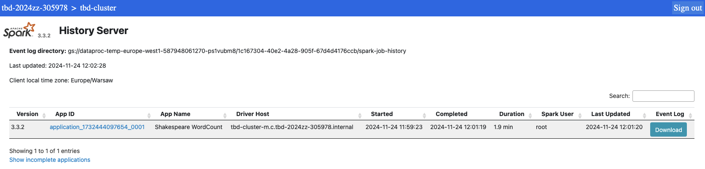

Widok po kliknięciu "App ID" z listy:
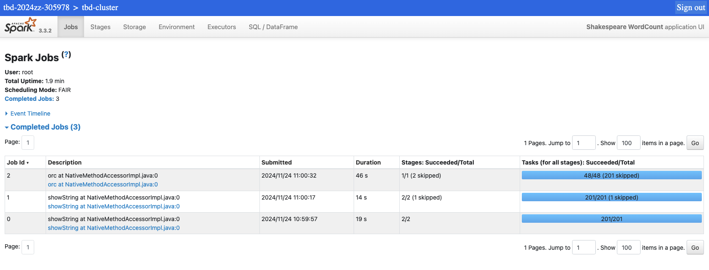
